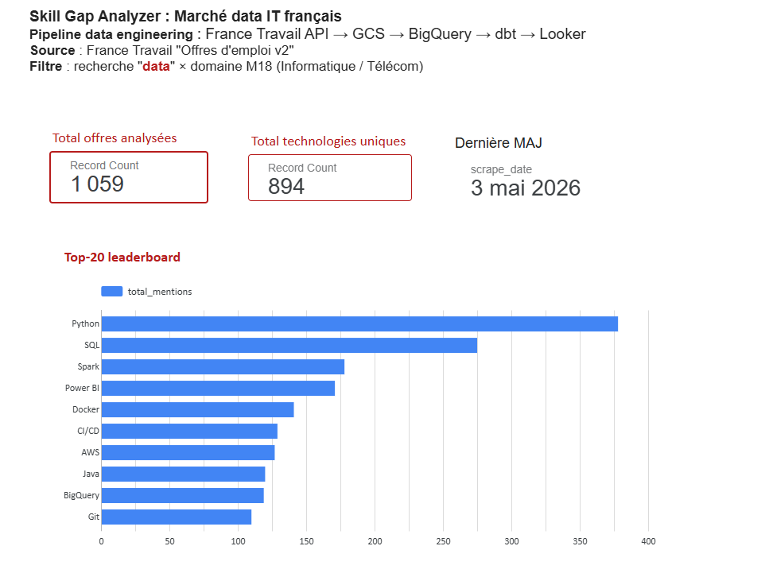
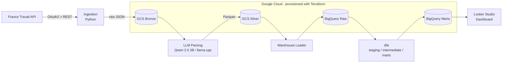
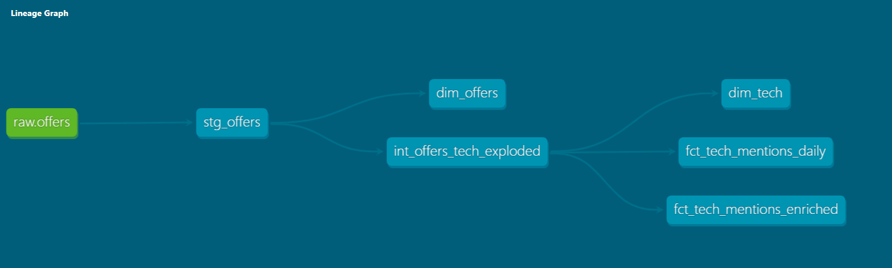

# skillgap-analyzer

**An end-to-end data engineering pipeline that maps the tech skills demanded by the French data job market.**

Job offers are ingested daily from the [France Travail API](https://francetravail.io/), a local LLM extracts the tech stack from each offer, and the results are modeled in BigQuery with dbt and served in a Looker Studio dashboard.


## Dashboard

Live insights on the most demanded technologies, by seniority, contract type and location.



> [View the live dashboard](https://datastudio.google.com/reporting/156ddeff-a070-4e8b-ad6f-5d0631357fdb/page/q93wF)

## Architecture



Everything runs as a single container on **Cloud Run Jobs**, dispatched per stage by an entrypoint script (`JOB_STAGE=ingest|parse|warehouse|dbt|all`).

## How it works

| Stage | Module | What it does |
|-------|--------|--------------|
| 1. Ingest | `skillgap` | Fetches data job offers (ROME domain M18) from the France Travail API, handles OAuth2 and pagination, lands raw JSON in the GCS bronze bucket. Supports `backfill` and `incremental` modes. |
| 2. Parse | `skillgap.parsing` | Runs each offer description through a quantized **Qwen 2.5 3B Instruct** model (GGUF, llama-cpp-python, CPU only) to extract the tech stack, validates the output with Pydantic, writes Parquet to the silver bucket. |
| 3. Load | `skillgap.warehouse` | Loads silver Parquet files into the BigQuery raw dataset, incrementally or as a full backfill. |
| 4. Model | `dbt` | Builds staging, intermediate and marts layers with schema tests: `dim_offers`, `dim_tech`, `fct_tech_mentions_daily`, `fct_tech_mentions_enriched`. |

### Why a local LLM?

Job descriptions are free text in French, with tech skills buried in prose. A small quantized model running on CPU extracts a clean `tech_stack` list per offer at zero API cost, with structured output validated by Pydantic.

### Data model

The dbt lineage graph, from the raw BigQuery table to the marts powering the dashboard:



## Tech stack

| Layer | Tools |
|-------|-------|
| Language and packaging | Python 3.12, uv, hatchling |
| Ingestion | httpx, tenacity (retry with backoff) |
| LLM extraction | llama-cpp-python, Qwen 2.5 3B Instruct (Q4_K_M GGUF), Pydantic |
| Storage | Google Cloud Storage (bronze / silver), Parquet via PyArrow |
| Warehouse | BigQuery, dbt (dbt-bigquery) |
| Visualization | Looker Studio |
| Infra | Terraform (GCS, BigQuery, IAM, Artifact Registry, Cloud Run), Docker multi-stage |
| Quality | ruff, mypy (strict), pytest + coverage, pre-commit, GitHub Actions |

## Project structure

```
skillgap-analyzer/
├── src/skillgap/
│   ├── ingestion/        # France Travail API client + OAuth2
│   ├── parsing/          # LLM pipeline, prompt, Pydantic schemas
│   ├── storage/          # GCS bronze (JSON) and silver (Parquet) writers
│   └── warehouse/        # Silver to BigQuery loader
├── dbt/skillgap_dbt/     # staging / intermediate / marts + tests
├── infra/terraform/      # GCS, BigQuery, IAM, Artifact Registry, Cloud Run
├── tests/                # unit + integration
├── Dockerfile            # multi-stage build, model baked in
└── entrypoint.sh         # stage dispatcher for Cloud Run Jobs
```

## Running locally

**Prerequisites:** Python 3.12, [uv](https://docs.astral.sh/uv/), a GCP project with the buckets and datasets (see `infra/terraform/`), France Travail API credentials, and the GGUF model file.

```bash
git clone https://github.com/Khalilz00/skillgap-analyzer.git
cd skillgap-analyzer
make install                 # uv sync with dev dependencies
cp .env.example .env         # fill in your credentials
```

Run the pipeline stage by stage:

```bash
uv run --env-file .env python -m skillgap             # 1. ingest -> bronze
uv run --env-file .env python -m skillgap.parsing     # 2. parse  -> silver
uv run --env-file .env python -m skillgap.warehouse   # 3. load   -> BigQuery

cd dbt/skillgap_dbt                                   # 4. model
uv run dbt build --profiles-dir .
```

Or run everything in Docker, the same way Cloud Run does:

```bash
make docker
docker run --env-file .env -e JOB_STAGE=all skillgap:dev
```

### Quality checks

```bash
make ci    # ruff + mypy strict + pytest with coverage
```

## Infrastructure

All GCP resources are managed with Terraform:

```bash
make tf-plan
make tf-apply
```

This provisions the bronze and silver GCS buckets, BigQuery datasets, the Artifact Registry repository, the Cloud Run job and the service accounts with least-privilege IAM roles.

## License

[MIT](LICENSE)
